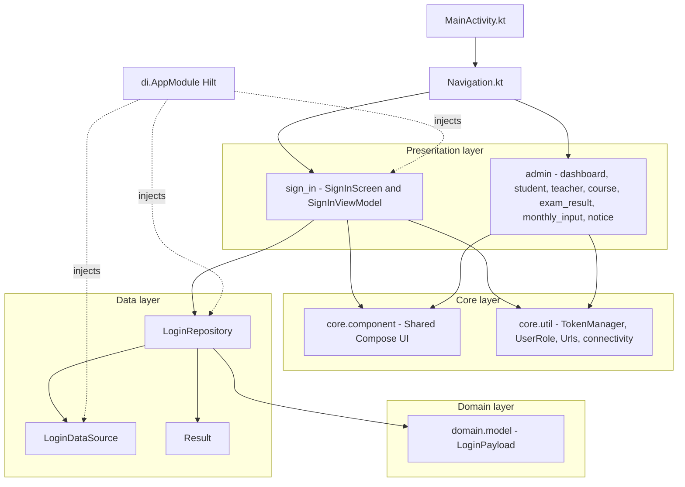

# Madrasha

An Android app for managing an Islamic school (madrasha) — role-based access for **Admin**, **Teacher**, and **Student**, covering courses, exam results, monthly progress input, and notices.

## Features
- Role-based sign-in and navigation (Admin / Teacher / Student)
- Admin dashboard: manage students, teachers, and courses
- Exam results tracking
- Monthly & weekly progress input for students
- Notice board for announcements

## Architecture

Built with **MVVM**, organized into clear layers:

- **data/** — `LoginRepository`, `LoginDataSource`, `Result` — handles data access and login flow.
- **domain/model/** — plain domain models (e.g. `LoginPayload`) decoupled from the data layer.
- **presentation/** — one package per screen/flow (`sign_in`, `admin/course`, `admin/student`, `admin/teacher`,
`admin/exam_result`, `admin/monthly_input`, `admin each with its own screen + `ViewModel`/`Event`where needed.
- **core/component/** — shared, reusable Compose Uar, top/bottom bars, nav drawer).
- **core/util/** — cross-cutting utilities (`TokenManager`, `UserRole`, `Urls`, connectivity check).
- **di/** — Hilt modules (`AppModule`) wiring depe

### Component Diagram



## Tech Stack
- **Kotlin**, Jetpack **Compose** (Material 3)
- **MVVM** architecture
- **Hilt** for dependency injection
- **Navigation Compose**
- **Coroutines**, LiveData, ViewModel

## Project Structure
```
app/src/main/java/com/khidmah/madrasha/
  core/
    component/     # Shared Compose UI components
    util/          # TokenManager, UserRole, Urls, connectivity, etc.
  data/            # LoginRepository, LoginDataSource, Result
  domain/model/    # LoginPayload
  di/              # Hilt AppModule
  presentation/
    sign_in/       # Sign-in screen + ViewModel
    admin/
      dashboard/   # Admin dashboard
      student/     # Student management
      teacher/     # Teacher management
      course/      # Course management
      exam_result/ # Exam results
      monthly_input/ # Monthly/weekly progress input
      notice/      # Notice board
  ui/theme/        # Compose theming (Color, Type, Theme)
  MainActivity.kt
  Navigation.kt
```

## Getting Started
1. Clone the repo and open it in Android Studio.
2. Sync Gradle and run on an emulator/device (minSdk 24).

## Status
Actively in development — role-based screens (Admin flows (sign-in, courses, exam results, notices)are in progress.
